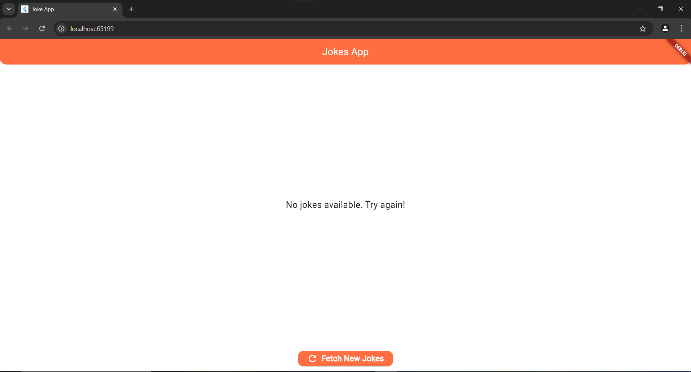

📱 Joke App
A simple Flutter application that fetches jokes from an API, caches them for offline access, and displays them in a beautiful UI.

🚀 Features
1.GET request to Jokes API
  Fetches jokes from Official Joke API.
2.Cache jokes for offline access
  Utilizes shared_preferences to cache jokes locally.
3.Offline functionality
  Displays cached jokes when the app is offline.
4.Elegant UI
  . Modern design with Material components.
  . Refresh the button to fetch new jokes.
5.Error Handling
  Displays user-friendly messages if fetching jokes fail.

📸 Screenshots  

| Jokes Display                         | Loading State                             | Error State                           |
|---------------------------------------|-------------------------------------------|---------------------------------------|
|  |  |  |

🛠️ Technologies Used

 . Flutter - Front-end framework.
 . Dart - Programming language.
 . HTTP - Handles API calls.
 . SharedPreferences - Caches jokes locally.

📦 Folder Structure

lib/
 ├── joke_cache.dart             # Handles local joke caching
 ├── joke_service.dart           # Handles API calls
 ├── main.dart                   # Entry point of the app
 ├── widgets/                    # All reusable UI components
 │    └── joke_widget.dart       # UI for displaying jokes
 ├── assets/                     # Images and screenshots (optional)
 └── pubspec.yaml                # Project dependencies

📝 Installation

Follow these steps to run the app on your local machine:
1.Prerequisites
  Ensure you have Flutter installed. Follow Flutter installation guide.

2.Clone the repository
  git clone https://github.com/yourusername/joke_app.git
  cd joke_app

3.Install dependencies
  flutter pub get

4.Run the app
  flutter run

⚙️ API Details

This app fetches jokes from:
Official Joke API

Example Response:
[
  {
    "id": 1,
    "type": "general",
    "setup": "Why don't skeletons fight each other?",
    "punchline": "They don't have the guts."
  },
  ...
]

🔧 Dependencies

The following packages are used in this app:
dependencies:
  flutter:
    sdk: flutter
  http: ^1.2.0               # For API calls
  shared_preferences: ^2.2.2 # For local caching
